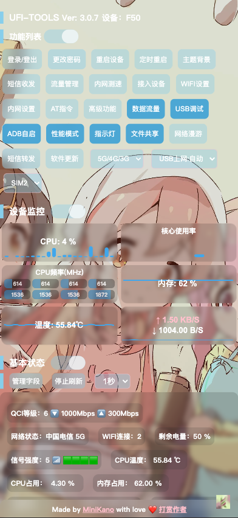
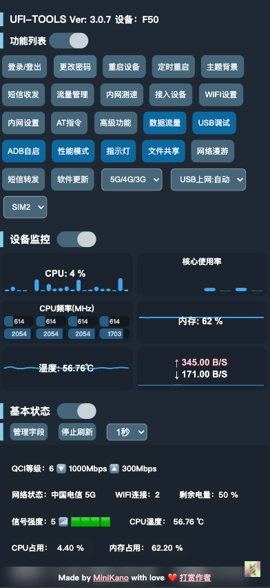
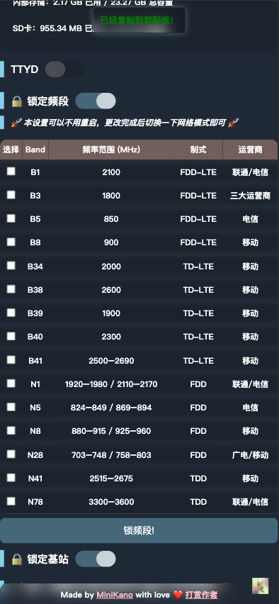

## 有哪些功能？
 
* **远程管理（需配合内网穿透）**
* **短信收发**
* **短信转发**
* **AT 指令发送**
* **内网测速**
* **主题+背景自定义**
* **各种参数实时显示（QCI 速率、CPU 温度、内存负载、信号强度、SNR、PCI、小区号、频段、IPv6 地址等）**
* **锁频段，锁小区（免重启）**
* **USB 调试，网络 USB 调试自启**
* **双端可用（既可手机安装使用（无），也可为 F50 作为服务端安装使用）**
* **开机自启**
* **一键 OTA**
* **性能模式、指示灯、文件共享开关**
* **3G/4G/5G 网络切换**
* **其他未来会继续更新功能**

|      |      |
| ---- | ---- |

|      |      |
| ---- | ---- |

## 如何使用？

**安卓用户**

1. 首先下载软件 apk，安装至自己的手机内并打开
2. 和随身 WiFi 处于同一个网络下，打开控制网页，登录并启用 adb 功能
3. 使用电脑或手机的 ADB 功能 连接上随身 WiFi 并将 apk 安装至随身 WiFi 机内
4. 使用 Scrcpy 等远程控制软件启动 zte-ufi-tools，设置网关，启动服务，并关掉电池优化，启用通知（确保能顺利开机自启）
5. 手机访问随身 WiFi 的 IP 地址，端口为 2333，即可使用

**iOS 用户**

> iOS 用户需要使用传统方法打开 adb，连接 WiFi 输入 http://192.168.0.1/index.html#usb_port 开启 adb
> 
> 之后的操作按照安卓用户**步骤 3** 开始即可

备注：功能是否能使用取决于你的机型和版本，目前我测试完美的版本是 **MU300_ZYV1.0.0B09**

备注 2：由于 CPU 使用率 温度 内存使用率并无官方接口，如果你将本 apk 安装在手机上使用，则温度和占用数据源是你的手机提供，并非随身 WiFi 数据。

下载链接：https://www.123684.com/s/7oa5Vv-dQLD3?pwd=CkSj

提取码：`CkSj`

API 文档：https://kanokano.cn/wp-content/uploads/2025/06/UFI-TOOLSAPI文档.html
