# UFI-TOOLS 用户说明书

## 目录

- [1. 简介](#1-简介)
  - [1.1 软件概述](#11-软件概述)
  - [1.2 软件定位](#12-软件定位)
  - [1.3 适用设备与兼容性](#13-适用设备与兼容性)
  - [1.4 部署形态与使用方式](#14-部署形态与使用方式)
  - [1.5 功能体系概览](#15-功能体系概览)
  - [1.6 典型使用场景](#16-典型使用场景)

- [2. 使用前说明](#2-使用前说明)
  - [2.1 使用环境要求](#21-使用环境要求)
  - [2.2 安装前准备](#22-安装前准备)
  - [2.3 风险提示与免责说明](#23-风险提示与免责说明)

- [3. 安装与首次使用](#3-安装与首次使用)
  - [3.1 设备端安装说明](#31-设备端安装说明)
  - [3.2 安装前连接设备](#32-安装前连接设备)
  - [3.3 使用 UFI-TOOLS 一键安装器安装](#33-使用-ufi-tools-一键安装器安装)
  - [3.4 手动安装 APK 到设备](#34-手动安装-apk-到设备)
  - [3.5 首次启动](#35-首次启动)
  - [3.6 基础权限与系统设置](#36-基础权限与系统设置)
  - [3.7 后台服务启动](#37-后台服务启动)
  - [3.8 登录与基础访问](#38-登录与基础访问)

- [4. 主界面说明](#4-主界面说明)
  - [4.1 页面布局](#41-页面布局)
  - [4.2 功能列表区](#42-功能列表区)
  - [4.3 设备监控区](#43-设备监控区)
  - [4.4 基本状态区](#44-基本状态区)
  - [4.5 刷新与字段管理](#45-刷新与字段管理)
  - [4.6 多语言与基础选项](#46-多语言与基础选项)

- [5. 账户与基础控制](#5-账户与基础控制)
  - [5.1 登录与登出](#51-登录与登出)
  - [5.2 更改口令](#52-更改口令)
  - [5.3 更改密码](#53-更改密码)
  - [5.4 重启设备](#54-重启设备)
  - [5.5 定时重启](#55-定时重启)
  - [5.6 关闭电源](#56-关闭电源)

- [6. 状态监控与设备信息](#6-状态监控与设备信息)
  - [6.1 基本状态](#61-基本状态)
  - [6.2 网络状态](#62-网络状态)
  - [6.3 流量统计](#63-流量统计)
  - [6.4 信号参数](#64-信号参数)
  - [6.5 设备属性](#65-设备属性)
  - [6.6 CPU、内存与温度](#66-cpu内存与温度)
  - [6.7 电池与供电信息](#67-电池与供电信息)

- [7. 网络与信号管理](#7-网络与信号管理)
  - [7.1 数据开关](#71-数据开关)
  - [7.2 网络模式切换](#72-网络模式切换)
  - [7.3 锁定频段](#73-锁定频段)
  - [7.4 锁定基站](#74-锁定基站)
  - [7.5 APN 设置](#75-apn-设置)
  - [7.6 网络漫游](#76-网络漫游)
  - [7.7 内网测速](#77-内网测速)
  - [7.8 流量测速](#78-流量测速)

- [8. 通信与调试功能](#8-通信与调试功能)
  - [8.1 短信收发](#81-短信收发)
  - [8.2 短信转发与设备信息通知](#82-短信转发与设备信息通知)
  - [8.3 AT 指令](#83-at-指令)
  - [8.4 USB 调试](#84-usb-调试)
  - [8.5 网络 ADB 自启](#85-网络-adb-自启)
  - [8.6 TTYD 终端](#86-ttyd-终端)

- [9. 系统与设备控制](#9-系统与设备控制)
  - [9.1 性能模式](#91-性能模式)
  - [9.2 指示灯控制](#92-指示灯控制)
  - [9.3 NFC 控制](#93-nfc-控制)
  - [9.4 文件共享（SMB）](#94-文件共享smb)
  - [9.5 休眠时间设置](#95-休眠时间设置)
  - [9.6 SIM 卡切换](#96-sim-卡切换)
  - [9.7 USB 上网模式](#97-usb-上网模式)
  - [9.8 USB 状态查看](#98-usb-状态查看)

- [10. 本地网络与接入管理](#10-本地网络与接入管理)
  - [10.1 WiFi 设置](#101-wifi-设置)
  - [10.2 内网设置](#102-内网设置)
  - [10.3 DHCP 设置](#103-dhcp-设置)
  - [10.4 接入设备管理](#104-接入设备管理)

- [11. 流量与自动化功能](#11-流量与自动化功能)
  - [11.1 流量管理](#111-流量管理)
  - [11.2 定时任务](#112-定时任务)
  - [11.3 自动执行动作说明](#113-自动执行动作说明)
  - [11.4 开机自启与脚本与定时脚本能力](#114-开机自启与脚本与定时脚本能力)

- [12. 高级功能](#12-高级功能)
  - [12.1 高级功能简介](#121-高级功能简介)
  - [12.2 开启条件](#122-开启条件)
  - [12.3 功能内容](#123-功能内容)
  - [12.4 使用注意事项](#124-使用注意事项)

- [13. 插件与界面个性化](#13-插件与界面个性化)
  - [13.1 插件功能总览](#131-插件功能总览)
  - [13.2 插件添加、编辑与启停](#132-插件添加编辑与启停)
  - [13.3 插件商店](#133-插件商店)
  - [13.4 插件导入与导出](#134-插件导入与导出)
  - [13.5 主题背景设置](#135-主题背景设置)
  - [13.6 上传文件管理](#136-上传文件管理)

- [14. 软件更新与远程访问](#14-软件更新与远程访问)
  - [14.1 软件更新](#141-软件更新)
  - [14.2 远程访问UFI-TOOLS](#142-远程访问ufi-tools)

- [15. 常见问题与故障排查](#15-常见问题与故障排查)
  - [15.1 无法访问后台](#151-无法访问后台)
  - [15.2 无法登录或鉴权失败](#152-无法登录或鉴权失败)
  - [15.3 部分功能不可用](#153-部分功能不可用)
  - [15.4 高级功能异常](#154-高级功能异常)

- [16. 附录](#16-附录)
  - [16.1 常见术语说明](#161-常见术语说明)
  - [16.2 默认地址与端口](#162-默认地址与端口)
  - [16.3 参考链接](#163-参考链接)

## 1. 简介

### 1.1 软件概述

> **UFI-TOOLS 是一款面向中兴 T760 系列 UFI / MiFi 随身 WiFi 设备的增强型综合管理后台。它在设备原有 Web 后台能力的基础上，提供了更完整的状态监控、更灵活的网络调试、更丰富的系统控制能力，以及面向进阶用户的插件扩展和高级管理功能。**
> **与传统仅覆盖基础联网配置的设备后台相比，UFI-TOOLS 更强调“可观测、可控制、可扩展”。用户不仅可以完成日常联网管理，还可以围绕信号、流量、短信、调试、自动化任务、插件和远程维护等需求进行统一操作。**

### 1.2 软件定位

UFI-TOOLS 的定位不是单一的“美化后台”或“辅助工具”，而是一个围绕随身 WiFi 设备构建的增强型全能管理后台，主要面向以下几类需求：

- 替代或补强原厂后台中不够直观、不够集中或不够开放的功能入口
- 为日常使用提供更详细的设备状态、网络状态和流量状态展示
- 为进阶用户提供锁频段、锁基站、AT 指令、APN 调整、USB 调试、无线ADB自启动等网络调试能力
- 为长期运行场景提供短信转发、定时任务、定时重启、远程访问、TTYD 等维护能力
- 通过高级功能和插件系统扩展设备能力，使设备具备更强的可定制性

因此，UFI-TOOLS 既可以作为普通用户的便捷管理后台使用，也可以作为进阶用户的调试与维护平台使用。

### 1.3 适用设备与兼容性

UFI-TOOLS 主要围绕中兴 T760 系列及相近平台设备设计，并优先适配常见的中兴随身 WiFi 设备。结合项目说明、界面信息和当前仓库内容，已适配或重点面向的设备包括但不限于：

- F50
- U30 Air
- V50
- U20（F50固件形态）
- M3（部分固件版本）
- 畅行 60 系列
- 云电脑 W200DS 系列

不同机型、不同固件版本、不同系统权限状态下，可使用功能会存在差异。部分功能依赖以下条件之一或多项同时满足：

- 设备本身提供对应接口
- 当前固件版本支持相关调用
- 已开启 USB 调试或网络 ADB
- 已启用高级功能
- 已将软件部署到目标设备本体

因此，说明书中提到的功能并不代表所有设备均可完全使用，实际应以当前机型和当前固件环境为准。

### 1.4 部署形态与使用方式

UFI-TOOLS 支持多种部署与使用方式，适用于不同用户场景：

- 手机端使用：将软件安装在手机上，通过连接随身 WiFi 设备进行管理，适合轻量使用和初步接入
- 设备端使用：将软件安装到随身 WiFi 设备本机，获得更完整的后台能力和更高的功能可用性，热点下的设备可以通过浏览器访问设备上的 UFI-TOOLS 后台页面进行集中管理

在不同部署形态下，功能完整度并不完全相同。通常情况下，将软件部署在目标设备本机时，可使用的功能最完整，尤其是涉及后台服务、自动化任务、高级功能、插件系统和系统级控制的部分。
本说明书主要对设备端使用场景进行说明描绘，因此也推荐用户将UFI-TOOLS安装在设备端使用。

### 1.5 功能体系概览

UFI-TOOLS 的功能体系可概括为以下几个部分：

- 基础访问与控制：登录登出、更改口令、更改密码、重启设备、定时重启、关闭电源
- 状态监控：设备基本状态、网络状态、流量统计、信号参数、CPU 使用率、CPU 频率、内存占用、温度、电池状态、USB 状态
- 网络与信号管理：数据开关、网络模式切换、锁定频段、锁定基站、APN 设置、网络漫游、内网测速、流量测速
- 通信与调试：短信收发、短信转发、AT 指令、USB 调试、网络 ADB 自启、TTYD 终端
- 系统控制：性能模式、指示灯、NFC、文件共享、休眠时间、SIM 卡切换、USB 上网模式
- 本地网络管理：WiFi 设置、内网设置、DHCP 设置、接入设备管理、黑名单管理
- 自动化功能：流量管理、定时任务、自动动作执行、定时重启、开机相关脚本能力
- 高级能力：高级功能开关、Root Shell 相关能力、TTYD 端口、系统级扩展
- 扩展与个性化：插件添加、编辑、启停、插件商店、主题背景设置、上传文件管理
- 运维能力：软件更新、局域网访问、远程访问、长期在线维护

这意味着 UFI-TOOLS 覆盖的范围已经不只是“查看设备状态”或“改几个网络参数”，而是围绕设备运行、联网、维护、自动化和扩展使用形成了一套完整的管理体系。
*部分功能以当前机型和当前固件环境为准

### 1.6 典型使用场景

UFI-TOOLS 适合以下常见场景：

- 日常查看设备联网状态、流量使用情况、信号质量和运行状态
- 根据使用环境切换网络模式、锁定频段或锁定基站，以改善稳定性或速率表现
- 远程接收短信验证码，并通过邮件、Webhook、钉钉或其他方式自动转发
- 通过定时任务实现自动重启、自动切换网络、自动开关 WiFi、自动解锁频段小区 或执行维护动作
- 在需要调试或维护设备时，使用 AT 指令、USB 调试、网络 ADB 或 TTYD 进行进一步操作
- 通过插件系统和主题功能扩展后台能力并进行界面个性化

对于普通用户，UFI-TOOLS 可以作为一个更易用、信息更完整的管理后台。对于进阶用户，它也提供了足够多的接口和功能入口，用于设备优化、远程运维和能力扩展。

## 2. 使用前说明

### 2.1 使用环境要求

在使用 UFI-TOOLS 前，建议确认当前设备与使用环境满足以下基本条件：

- 目标设备为中兴 T760 系列或相近平台的 UFI / MiFi 随身 WiFi 设备，或已经验证兼容的相关机型
- 设备能够正常开机、正常联网，并可访问原厂后台
- 用户具备通过浏览器访问设备管理页面的基本条件
- 具备将 UFI-TOOLS 安装到目标设备本机的条件（启用 USB 调试 或者 网络 ADB 调试）
- 其他能将 UFI-TOOLS 正常安装进设备内的条件

建议的使用环境如下：

- 稳定的局域网环境，确保手机、电脑与随身 WiFi 设备之间可以互相访问
- 在首次安装或启用部分功能时，具备 ADB 或其他基础调试工具的使用条件
- 在使用远程访问、短信转发、插件商店、软件更新等功能时，具备可用的网络连接

说明：

- 不同机型、不同固件版本下，功能支持范围会有所不同
- 部分功能需要开启高级功能后方可使用

### 2.2 安装前准备

为保证安装与首次使用过程顺利，建议在安装前完成以下准备工作：

1. 确认设备信息  
   建议先确认目标设备的型号、系统版本、固件版本以及当前是否能够正常访问原厂后台。若设备本身存在异常、无法联网或系统状态不稳定，建议先恢复设备基础功能后再安装 UFI-TOOLS。

2. 准备访问与调试条件  
   若计划将软件安装到随身 WiFi 设备内，通常需要提前准备以下条件之一：

- 已开启设备调试（USB调试）
- 可通过 USB ADB 连接设备
- 或者可通过网络 ADB 连接设备

3. 备份重要数据  
   在执行安装、升级、开启高级功能、修改网络参数、安装插件等操作前，建议备份以下内容：

- 当前网络配置
- APN 配置
- WiFi 名称与密码
- 重要插件配置
- 设备内重要文件或脚本

4. 保持设备供电稳定  
   在安装软件、执行 OTA 更新、添加高级功能或进行其他系统级修改时，建议确保设备电量充足，或外接稳定电源，避免因断电导致安装失败、配置损坏或系统异常。

5. 关闭不必要干扰  
   在首次部署和调试阶段，建议尽量避免以下情况：

- 频繁切换网络环境
- 在安装过程中主动重启设备
- 同时使用多个工具反复修改同一项系统设置
- 在未确认兼容性的情况下安装过多插件

### 2.3 风险提示与免责说明

> UFI-TOOLS 是一款面向设备增强管理与高级维护场景的工具。部分功能涉及设备系统设置、网络参数、调试接口或扩展能力变更，因此在使用前应充分了解相关风险。

请重点注意以下事项：

- 锁频段、锁基站、网络模式切换、APN 修改等操作，可能导致设备暂时无信号、无法注册网络或网络性能下降
- 启用 USB 调试、网络 ADB、TTYD、高级功能等操作，会提高设备可操作性，同时也会带来额外的安全暴露面
- 软件更新、安装插件、修改系统级配置或执行高级功能时，可能因机型差异、固件差异或环境异常导致功能失效、配置丢失或设备异常
- 定时任务、短信转发、自动执行动作等功能，若配置不当，可能造成误操作、重复执行或额外的网络与电量消耗
- 部分第三方插件可能影响设备性能、稳定性或兼容性，安装前应自行评估风险
- 使用AT指令时候请确保自己输入的指令正确，另外，内置卡用户、物联卡用户请避免在使用过程中随意更改设备IMEI

建议遵循以下使用原则：

- 首次使用时，先从基础功能开始，不建议一开始就集中启用所有高级能力
- 对网络参数、调试接口和高级功能的修改，应逐项操作、逐项验证
- 涉及长期运行的功能，如短信转发、定时任务、远程访问等，建议先在受控环境中测试后再投入正式使用
- 如当前设备承担重要通信任务，请避免在重要使用场景下进行高风险设置变更

免责说明：

**UFI-TOOLS 为开源工具，按当前状态提供，不保证适用于所有机型、所有固件版本及所有使用场景。因使用本软件造成的设备异常、数据丢失、配置损坏、联网故障、性能下降或其他直接、间接损失，使用者需自行承担相应风险与责任。**

如您对相关操作的含义、影响范围或恢复方法尚不明确，建议在继续操作前先完成固件与资料备份，并充分理解对应功能后再使用。

## 3. 安装与首次使用

参考教程：
**UFI-TOOLS 通用安装教程：[📺 B站视频](https://www.bilibili.com/video/BV1qUHpzeEDd)**  
**Magisk 模块版本（畅行60 / 云电脑）安装教程：[📺 B站视频**](https://www.bilibili.com/video/BV1nsW4zpE1T)

### 3.1 设备端安装说明

> 本说明书后续内容默认采用“设备端安装”作为标准使用场景，即将 UFI-TOOLS 直接安装到随身 WiFi 设备本机，再通过浏览器访问其 Web 管理后台。

这是当前最推荐的部署方式，主要原因如下：

- 功能完整度最高
- 状态监控与系统控制更准确
- 便于启用后台服务、自动化任务和高级功能
- 更适合长期运行和后续维护

因此，除临时测试外，建议优先将 UFI-TOOLS 部署到目标设备本机，而不是仅通过外部设备做辅助控制。

### 3.2 安装前连接设备

> 在将 UFI-TOOLS 安装到设备前，需要先建立对目标设备的可操作连接。

推荐流程如下：

1. 将电脑或手机连接到目标随身 WiFi 所在网络。  
2. 打开设备原厂后台，确认设备当前联网和管理页面访问正常。  
3. 在原厂后台中启用调试相关入口，例如 ADB 或 USB 调试功能。  
4. 使用 ADB 工具与设备建立连接。  

说明：

- 若设备支持 USB 有线调试，优先使用 USB ADB 有线调试方式连接
- 若设备支持网络调试，也可使用网络 ADB 方式连接
- 若安装完成后还需要对设备界面进行远程操作，可配合 Scrcpy 等工具使用

若当前设备无法开启调试入口或无法建立 ADB 连接，建议先排查原厂后台设置、连接线、驱动、网络连通性及固件兼容性，再继续安装。
如果当前固件无法打开ADB，请考虑直接Root设备，或者降级固件到兼容版本

### 3.3 使用 UFI-TOOLS 一键安装器安装

> 对于大多数用户，推荐优先使用 `UFI-TOOLS 一键安装器` 完成设备端部署。  
> 与手动 ADB 安装相比，一键安装器通常更适合首次接触此类设备的用户，操作流程更集中，也更便于减少中间步骤出错。

推荐流程如下：

1. 在电脑上准备好 `UFI-TOOLS 一键安装器` 和对应版本的安装包。  
2. 按教程要求，将目标设备通过USB线缆接入到电脑，并使用浏览器尝试访问设备的官方后台，确认可访问后再执行下一步。
3. 打开安装器，安装器会自动打开设备的USB调试功能，自动进行安装部署
4. 等待安装完成后，连接WiFi，使用浏览器访问UFI-TOOLS后台，确认 UFI-TOOLS 已成功部署到设备本机。  

一键安装器适合以下场景：

- 希望减少手动输入 ADB 命令的用户
- 首次安装设备端后台的用户
- 希望更快完成标准部署流程的用户

使用一键安装器时，仍建议注意以下事项：

- 安装前确认设备当前能正常开机并可进入原厂后台
- 安装过程中避免断电、断开连接或频繁切换网络
- 若安装器识别失败，应先检查设备调试状态、连接方式和驱动环境
- 若自动安装失败，可改用手动 ADB 安装方式继续部署

如果您的固件比较特殊，可以尝试 aaadddbbb.exe 临时打开无线ADB，然后接着使用一键安装器继续安装流程。

所需工具下载地址：https://pan.kanokano.cn/UFI-TOOLS-UPDATE/UFI-TOOLS%E4%B8%80%E9%94%AE%E5%AE%89%E8%A3%85%E5%99%A8

### 3.4 手动安装 APK 到设备

> 当一键安装器不可用，或需要手动排查安装问题时，也可以采用传统的 ADB 安装方式。

建议按以下顺序操作：

1. 准备好 UFI-TOOLS 的 APK 安装包。  
2. 确认 ADB 已正确识别目标设备。  
3. 通过 ADB 将 APK 安装到目标设备本机。  
4. 安装完成后，在设备应用列表中找到 UFI-TOOLS 并启动。  
5. 设置好应用的后台权限与自启动权限，确保授权完整。

手动安装方式更适合以下场景：

- 需要自行控制安装过程
- 需要排查安装器无法识别或无法部署的问题
- 需要针对特殊设备环境进行单独处理

安装过程中建议注意以下事项：

- 若设备中已存在旧版本，请先确认是否需要覆盖安装
- 若安装失败，应优先检查 ADB 连接状态、设备存储空间以及系统是否拦截安装
- 若通过投屏方式操作设备，请尽量保持连接稳定，避免安装过程中中断

> **如果上述办法都无法安装，请考虑将设备Root，刷入预先打开USB调试的Root包进行强制开启ADB操作。**

### 3.5 首次启动

> 首次在设备端启动 UFI-TOOLS 后，建议先完成基本初始化确认，而不要立即修改大量设置。

首次启动时，建议重点确认以下内容：

- 应用能够正常打开，没有闪退或明显异常
- 当前设备型号与运行环境识别正常
- 后台服务具备正常启动条件
- 正常区分UFI后台口令和官方后台密码

根据当前项目说明，首次启动后通常需要进行以下基础操作：

1. 确认网关地址  
   网关地址通常为设备当前局域网访问地址，例如 `192.168.0.1`，实际应以当前设备网络环境为准。

2. 修改或确认后台口令  
   UFI-TOOLS 后台登录需要使用独立口令。若当前仍为默认简单口令，系统会弹窗弱口令修改提示，建议在首次部署时尽快修改。

3. 准备启动后台服务  
   在应用内确认服务启动入口可用，并观察后续 Web 服务能否正常运行。

### 3.6 基础权限与系统设置

> 为了保证后台能够稳定运行，首次安装完成后建议尽快完成以下系统设置：

1. 关闭电池优化  
   若系统对 UFI-TOOLS 启用了电池优化，可能导致后台服务被系统回收，从而影响网页访问、自动化任务、短信转发和开机自启。

2. 启用通知权限  
   UFI-TOOLS 的后台服务依赖前台服务机制运行。若通知权限未开启，部分系统可能会影响服务稳定性。

3. 检查后台运行权限  
   若系统提供自启动、后台保活、后台冻结等限制选项，建议为 UFI-TOOLS 放行，以便后续持续运行。

*如果用户使用 `UFI-TOOLS 一键安装器` 安装的高级后台，则上述权限无需手动配置，安装器会自动授权。*

4. 按需确认调试能力  
   若后续需要使用软件更新、网络 ADB、自定义调试等，建议同步确认 USB 调试与网络 ADB 的条件是否满足，或直接启用高级功能。

完成这些设置后，建议先验证一次后台服务是否能够稳定运行，再进行后续网络、短信或插件配置。

### 3.7 后台服务启动

> UFI-TOOLS 的 Web 管理后台依赖设备端服务启动后才能访问，因此服务启动是整个部署流程中的关键步骤。

根据当前项目实现，使用安装器安装完成后，服务会自动启动，后台默认端口为：

`2333`

常见访问格式为：

`http://设备网关IP:2333`

例如：

`http://192.168.0.1:2333`

说明：

- 若设备网关地址已修改，应以实际网关为准
- 若服务启动失败，应优先检查网关设置、权限状态和后台运行限制
- 若端口无法访问，也应检查当前设备与访问终端是否处于同一网络

### 3.8 登录与基础访问

> 后台服务启动成功后，即可通过浏览器访问 UFI-TOOLS 管理后台。

推荐访问流程如下：

1. 使用与设备处于同一网络的电脑、手机或平板打开浏览器。  
2. 输入当前设备访问地址，例如 `http://192.168.0.1:2333`。  
3. 打开登录页面后，按提示输入登录信息。  

根据当前前端界面，登录时通常需要提供以下信息：

- UFI-TOOLS 后台口令
- 设备官方后台管理密码

> 因为 UFI-TOOLS 的部分功能是直接依靠官方后台的接口，所以这部分功能是需要提供设备官方后台的管理密码的
> 用户一开始可能会对两个密码框感到到奇怪，实际上这正是出于安全考虑不得不做的加固，也符合本软件的设计目标

补充说明：

- 官方后台管理密码通常可在设备背面标签处找到
- 若登录页面提供多种登录方式，可先使用默认方式；如验证失败，再尝试切换其他方式
- 若登录后页面无法刷新或部分功能不可用，应优先检查网关地址、口令、官方后台密码以及当前固件兼容性

首次成功登录后，建议先完成以下验证：

- 检查首页是否能正常显示“设备监控”和“基本状态”
- 尝试手动刷新数据，确认后台通信正常
- 确认页面可持续更新，而不是短暂显示后失去响应
- 确认登录状态稳定，再继续配置后续功能

## 4. 主界面说明

### 4.1 页面布局

> UFI-TOOLS 的主界面采用模块化布局，登录成功后，用户会看到以下几个主要区域：

| 分类     | 内容                                   |
| -------- | -------------------------------------- |
| 页面结构 | 顶部标题区、功能列表区、功能模块展开区 |
| 信息展示 | 设备监控区、基本状态区                 |

整体设计思路是将“常用操作入口”和“实时状态信息”集中显示，便于用户在同一页面内完成查看、判断和操作，而不需要频繁切换页面。

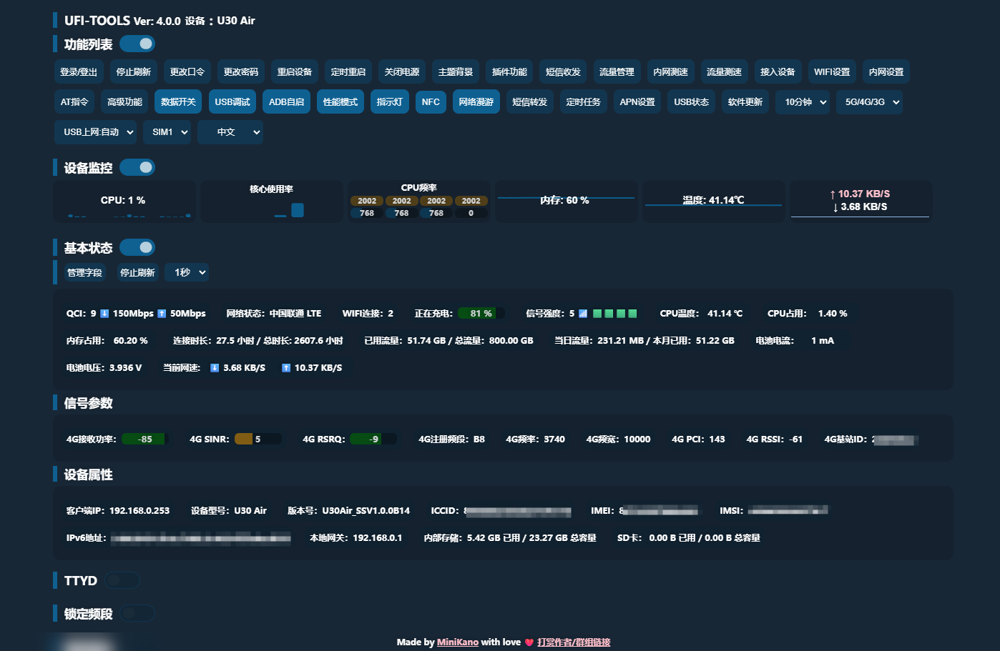

### 4.2 功能列表区

> 功能列表区位于主界面上方，是后台最主要的操作入口区域。用户可以通过这里快速进入常用功能，或直接执行部分快捷操作。

该区域包括以下内容：

| 分类       | 内容                                            |
| ---------- | ----------------------------------------------- |
| 账户与安全 | 登录/登出、更改口令、更改密码                   |
| 电源管理   | 重启设备、定时重启、关闭电源                    |
| 系统与界面 | 主题背景、插件功能、性能模式、指示灯            |
| 网络功能   | 流量管理、内网测速、流量测速、网络漫游、APN设置 |
| 通信功能   | 短信收发、短信转发                              |
| 设备与连接 | 接入设备、WiFi设置、内网设置、USB状态           |
| 开发与高级 | AT指令、高级功能、USB调试、ADB自启              |
| 数据与服务 | 数据开关、文件共享、定时任务、NFC               |
| 系统维护   | 软件更新                                        |

此外，功能列表区还集成了若干快捷下拉选项，例如：

| 分类     | 内容                                     |
| -------- | ---------------------------------------- |
| 系统设置 | 休眠时间设置、语言切换                   |
| 网络设置 | 网络模式切换、USB上网模式切换、SIM卡切换 |

功能列表区支持折叠与展开。对于屏幕较小的设备，建议按需折叠，以便为状态监控和参数显示区域留出更多空间。


### 4.3 设备监控区

> 设备监控区用于显示设备运行过程中的动态图表信息，是用户观察设备实时状态的重要区域。

设备监控区包含以下内容：

| 分类     | 内容                                                   |
| -------- | ------------------------------------------------------ |
| CPU相关  | CPU使用率图表、CPU核心使用率图表、CPU频率、CPU温度图表 |
| 系统资源 | 内存占用图表                                           |
| 网络     | 当前网络速率图表                                       |

该区域主要用于帮助用户快速判断设备是否存在以下情况：

| 分类    | 内容                      |
| ------- | ------------------------- |
| CPU异常 | CPU负载过高、核心异常满载 |
| 内存    | 内存占用过高              |
| 温度    | 设备温度异常升高          |
| 网络    | 网络吞吐变化明显          |

这一区域更适合做“趋势观察”，而不是只看某一个瞬时数值。  
若用户正在进行测速、插件运行、或高负载操作，可以优先观察此区域变化。


### 4.4 基本状态区

> 基本状态区用于集中显示设备当前的主要状态参数，是后台首页中信息密度最高的区域之一。

该区域会分为若干信息段落，例如：

- 基本状态
- 信号参数
- 设备属性

其中可能显示的内容包括但不限于：

| 分类   | 内容                                              |
| ------ | ------------------------------------------------- |
| 状态类 | QCI与速率、网络状态、WiFi数量、连接时长           |
| 性能类 | CPU温度、CPU占用、内存占用                        |
| 电池类 | 电量与充电、电流与电压                            |
| 网络类 | 信号强度、上下行速率、5G/4G参数、频段/PCI等       |
| 设备类 | 客户端IP、设备型号、固件版本、本地网关、IMEI/IMSI |
| 存储类 | 内部存储与SD卡状态                                |
| 流量类 | 已用流量、当日流量、本月流量                      |

这一区域适合用户在以下场景下使用：

- 快速确认设备当前是否在线
- 判断当前网络质量是否正常
- 观察流量使用情况
- 排查设备发热、负载或供电问题
- 检查设备型号、版本和本地网络信息

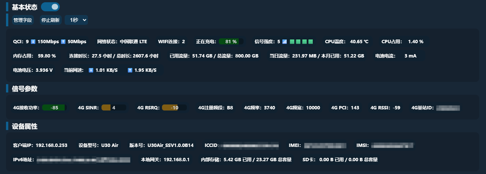

### 4.5 刷新与字段管理

> 主界面中的状态信息支持自动刷新。为了兼顾实时性和设备负载，后台提供了刷新控制与字段管理功能。

中常见的相关操作包括：

- 停止刷新
- 选择刷新频率
- 管理字段

其中：

- “停止刷新”用于临时停止页面自动更新，适合在查看某些瞬时参数、复制信息或执行锁频锁站等操作时使用
- “刷新频率”用于调整状态更新速度，刷新越快，页面数据越实时，但同时也可能增加设备负载
- “管理字段”用于控制基本状态区显示哪些字段，适合按个人需求精简页面内容

建议：

- 日常使用时，可选择中等刷新频率(1S)
- 进行信号观察、测速或排障时，可临时提高刷新频率
- 在需要稳定选择小区、复制参数或截图留档时，可先停止刷新

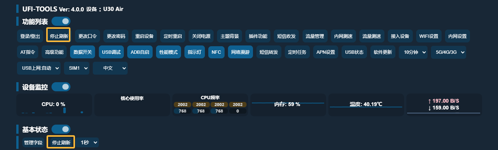


### 4.6 多语言与基础选项

> 主界面还提供若干基础选项，用于快速调整设备工作方式和界面语言。

可见的基础选项主要包括：

- 语言切换
- 网络模式切换
- USB 上网模式切换
- SIM 卡切换
- 休眠时间设置

这些选项以顶部下拉框形式存在，便于用户快速修改常见配置。

其中：

- 语言切换用于切换后台界面显示语言
- 网络模式切换用于在 3G / 4G / 5G 等模式之间调整
- USB 上网模式切换用于设置 USB 网络输出方式
- SIM 卡切换用于切换当前使用的卡槽或对应运营商
- 休眠时间设置用于控制设备进入休眠的时间策略

在执行这些操作后，建议观察“基本状态区”的反馈是否已同步更新，以确认设置已生效。

## 5. 账户与基础控制

### 5.1 登录与登出

> UFI-TOOLS 后台登录入口位于功能列表区，以“登录/登出”按钮显示。首次访问后台时，系统会弹出登录窗口，要求用户输入认证信息。

登录需要填写以下两项内容：

- UFI-TOOLS 登录口令
- 设备官方后台管理密码

其中：

- UFI-TOOLS 登录口令用于登录当前高级后台
- 官方后台管理密码用于调用设备原厂接口，可在设备背面标签处找到

还提供两种登录方式：

- 登录方式 1
- 登录方式 2

一般建议先使用默认方式登录。若提示密码错误、登录异常或兼容性问题，可切换另一种方式再次尝试。

补充说明：

- 登录方式 1 性能更好，登录状态更稳定
- 登录方式 2 兼容性更强，但可能存在登录时效限制

若要退出当前登录状态，可再次点击“登录/登出”按钮执行登出操作。


### 5.2 更改口令

> “更改口令”用于修改 UFI-TOOLS 后台自身的登录口令。  
> 该口令不同于设备原厂后台密码，属于 UFI-TOOLS 的独立访问凭据。

在使用本功能时，建议注意以下事项：

- 默认简单口令仅适合首次部署验证，不建议长期使用
- 建议尽快修改为复杂度更高且不易猜测的口令
- 修改后，后续登录后台时需要使用新的口令

操作流程如下：

1. 登录后台。  
2. 点击“更改口令”。  
3. 输入新口令。  
4. 再次输入确认口令。  
5. 提交并等待系统保存，系统提交完成后会弹窗确认用户输入的密码，并提示用户截图保存。  

建议：

- 新口令不要与设备默认管理密码完全相同
- 修改完成后，建议立即重新登录一次，确认新口令已经生效


### 5.3 更改密码

> “更改密码”用于修改设备原厂 Web 后台的管理密码。  
> 该功能对应的是设备本身的后台认证密码，而不是 UFI-TOOLS 登录口令。

使用该功能前应明确：

- 修改的是设备原厂后台密码
- 修改成功后，后续登录 UFI-TOOLS 时也需要输入新的原厂后台密码
- 若遗忘该密码，后续可能影响原厂后台访问和部分接口调用

建议在以下情况下使用本功能：

- 设备仍在使用出厂默认密码
- 设备长期暴露在局域网或远程访问环境中
- 需要提升整体后台访问安全性

修改完成后，建议同步记录新密码，并重新验证以下内容：

- 原厂后台是否可以正常登录
- UFI-TOOLS 是否仍可正常登录和调用功能


### 5.4 重启设备

> “重启设备”用于执行设备整机重启。  
> 该功能适合在修改某些配置后使设置生效，或在设备运行异常时尝试恢复。

重启操作带有多次点击确认机制，目的是防止误触。  
用户需要连续多次点击后，系统才会真正执行重启操作。

适合使用重启功能的场景包括：

- 某些网络设置修改后需要重启生效
- 设备运行时间过长，需要重新初始化状态
- 部分异常功能在重新启动后可恢复
- 软件安装、升级或系统级调整后需要重启验证

注意：

- 重启过程中，设备会短暂断网
- 所有依赖当前连接的网页访问会中断
- 若设备承担重要联网任务，应选择合适时机执行

### 5.5 定时重启

> “定时重启”用于设置设备每天在固定时间自动重启。  
> 该功能适合长期运行场景，例如设备持续在线、长期插电、需要周期性刷新网络状态等情况。

定时重启包含以下配置项：

- 是否启用每日定时重启
- 每日重启时间

建议操作流程如下：

1. 打开“定时重启”设置窗口。  
2. 选择是否启用。  
3. 输入每日重启时间，例如 `00:00`。  
4. 提交保存。  

使用建议：

- 建议将重启时间设置在低使用时段
- 若设备用于远程值守，建议避开业务高峰期
- 若设置时间格式错误，系统不会保存

定时重启常见用途包括：

- 长期运行设备的日常维护
- 周期性刷新网络状态
- 降低长时间运行后出现异常的概率


### 5.6 关闭电源

> “关闭电源”用于执行设备关机操作。  
> 与“重启设备”不同，关闭电源后设备不会自动恢复运行，需要人工重新开机或重新供电。

关机功能同样带有确认机制，用于防止误触导致设备直接离线。

适合使用关机功能的场景包括：

- 需要彻底停止设备运行
- 需要断开现场设备并进行维护
- 某些特定机型支持软件控制关机

注意事项：

- 并非所有机型都完全支持软件关机
- 关机后后台网页会立即失去连接
- 若设备处于远程环境，执行关机前应确认现场具备重新开机条件

因此，在远程环境下使用“关闭电源”功能时应格外谨慎，避免设备关机后无法及时恢复。

## 6. 状态监控与设备信息

### 6.1 基本状态

> “基本状态”区域用于汇总显示设备当前最核心的运行信息，适合用户在进入后台后第一时间查看。

常见可见内容包括：

- 网络状态
- WiFi 连接数量
- 电池电量与充电状态
- 信号强度
- CPU 温度
- CPU 占用
- 内存占用
- 连接时长
- 已用流量
- 当日流量
- 本月已用流量
- 电池电流与电压
- 当前网速

这一区域适合用来快速判断以下问题：

- 设备是否正常联网
- 当前网络是否稳定
- 是否存在过热或高负载
- 流量是否异常增长
- 当前是否处于充电状态

对于日常使用，建议优先关注“网络状态”“信号强度”“当前网速”“CPU 温度”和“已用流量”几个指标。

### 6.2 网络状态

“网络状态”用于显示设备当前所连接的蜂窝网络类型及运营状态，例如：

- 当前是否已接入运营商网络
- 当前属于 3G、4G、5G 或其他状态
- 当前网络是否正常注册

在日常观察中：

- 若显示正常运营商名称与网络类型，表示设备已成功入网
- 若网络状态异常、空白或长时间不变，应优先检查 SIM 卡、信号、APN、网络模式或基站连接情况

同时，“WiFi 连接”字段可帮助用户了解当前有多少终端设备已接入该设备热点。  
若接入数量异常偏多，也可能影响设备负载与网络体验。

### 6.3 流量统计

流量统计用于帮助用户掌握设备使用情况，后台会显示以下几类信息：

- 已用流量
- 总流量
- 当日流量
- 本月已用流量
- 当前网速

这些数据适合用于以下场景：

- 观察是否接近套餐上限
- 判断是否存在异常跑流量
- 了解某段时间的使用强度
- 配合流量管理功能进行预警和控制

其中：

- “已用流量/总流量”表示值月统计值与累计统计值，数据来源为原厂后台
- “当日流量”适合观察当天使用情况，数据来源为Android自带的流量统计
- “本月已用流量”适合与运营商套餐周期对应，数据来源为Android自带的流量统计，相比原厂后台来说统计更准确
- “当前网速”用于显示实时上下行速率，更适合观察瞬时变化

如果用户发现流量增长异常，建议结合“接入设备”“插件运行情况”以及“当前网速”一并排查。

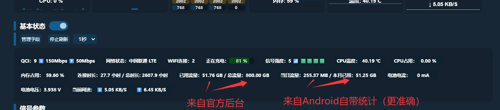

### 6.4 信号参数

> “信号参数”区域用于显示设备当前连接网络时的无线信号质量和基站相关信息。  
> 这是网络优化、锁频段、锁基站和故障排查时最重要的数据来源之一。

根据当前后台显示，常见信号参数包括：

| 分类        | 内容                                                         |
| ----------- | ------------------------------------------------------------ |
| 4G 信号参数 | 接收功率（RSRP）、SINR、注册频段、频率、频宽、PCI、RSRQ、RSSI、基站ID |
| 5G 信号参数 | 接收功率（RSRP）、SINR、注册频段、频率、频宽、PCI、RSRQ、RSSI、基站ID |

用户在阅读这些参数时，可先抓住以下重点：

- RSRP 主要反映接收功率强弱
- SINR 主要反映信号质量和干扰情况
- RSRQ 可辅助判断当前链路质量
- 频段、频率、PCI、基站 ID 可用于锁频锁站操作和问题定位

一般来说：

- 接收功率越强，基础覆盖越好
- SINR 越高，表示链路质量越好
- 若信号功率尚可但速率很差，应重点观察 SINR、RSRQ、当前频段及基站情况

这一区域建议与第 7 章“网络与信号管理”结合阅读，便于边观察边优化。

### 6.5 设备属性

> “设备属性”区域用于显示设备本身的标识信息、版本信息和本地网络信息。  
> 与“基本状态”和“信号参数”相比，这部分数据变化较少，更适合用于确认设备身份、系统版本和环境信息。

根据当前后台，设备属性中常见的内容包括：

| 分类     | 内容                                  |
| -------- | ------------------------------------- |
| 网络信息 | 客户端IP、IPv6地址、本地网关、MAC地址 |
| 设备信息 | 设备型号、版本号                      |
| 身份信息 | 手机号、ICCID、IMEI、IMSI             |
| 存储信息 | 内部存储、SD卡                        |

这部分信息主要适用于以下场景：

- 确认当前登录的是否为目标设备
- 查看设备当前固件版本或软件版本
- 排查本地网络地址是否正确
- 确认 IPv6 地址是否已分配
- 检查内部存储和 SD 卡剩余空间
- 在调试、运维或更换设备时进行身份核对

建议重点关注以下字段：

- “设备型号”：用于确认机型
- “版本号”：用于判断当前固件环境和兼容性
- “本地网关”：用于确认后台访问地址是否正确
- “内部存储 / SD 卡”：用于判断是否存在空间不足问题

对于需要长期维护设备的用户，这一区域也可作为记录设备基础信息的参考来源。

### 6.6 CPU、内存与温度

> 后台通过“设备监控”和“基本状态”两处共同展示设备运行负载情况。  
> 这部分信息主要用于判断后台是否运行平稳，以及当前是否存在性能压力。

常见指标包括：

- CPU 使用率
- CPU 核心使用率
- CPU 频率
- 内存占用
- CPU 温度

这些指标适合用于以下判断：

- CPU 持续高占用，可能表示存在高负载任务、插件占用或异常进程
- 内存长期高占用，可能导致系统运行卡顿或后台服务不稳定
- 温度持续偏高，可能影响设备稳定性，甚至触发降频
- CPU 频率长期拉满，说明设备正处于较高负载状态

若用户发现后台卡顿、网页刷新变慢、服务偶发异常，建议优先查看本部分数据。

此外，点击相关图表后，部分界面还可查看更详细的温度信息与内存信息，适合进一步排查问题。


### 6.7 电池与供电信息

若设备具备电池与电源信息采集能力，后台会显示以下项目：

- 电池电量
- 充电状态
- 电池电流
- 电池电压

这些信息主要用于判断以下问题：

- 设备当前是否正在充电
- 电池电量是否充足
- 供电是否稳定
- 是否存在异常耗电

在长期运行场景下，建议重点观察：

- 电量是否长期过低
- 电流是否异常波动
- 在外接供电时是否仍然掉电

若设备用于固定部署、长时间在线、远程值守或短信转发场景，这部分信息尤其值得长期关注。

## 7. 网络与信号管理

### 7.1 数据开关

> “数据开关”用于控制设备蜂窝数据连接的启用与关闭。  
> 这是最基础的网络控制项之一，适合在需要临时断开蜂窝数据、切换环境或排查联网问题时使用。

常见使用场景包括：

- 临时关闭移动数据连接
- 排查设备无法联网时进行重置操作
- 配合 APN、网络模式或锁频锁站操作进行测试

使用建议：

- 若关闭数据开关，设备可能仍保持局域网访问，但无法继续通过蜂窝网络上网
- 若重新开启后仍无法联网，应继续检查 APN、网络模式、SIM 状态和信号情况
- 数据开关切换有时会不同步，如果状态不同步，请刷新页面

### 7.2 网络模式切换

网络模式切换用于控制设备优先使用哪一类蜂窝网络。  
常见可选模式包括：

- 5G/4G/3G
- 5G NSA
- 5G SA
- 4G/3G
- 仅 4G
- 仅 3G

不同模式适用于不同场景：

- `5G/4G/3G`：适合日常默认使用，兼顾兼容性
- `5G NSA`：适合需要测试 NSA 组网环境时使用
- `5G SA`：适合设备和网络均支持 SA，且希望优先使用独立组网 5G 时使用
- `4G/3G`：适合 5G 信号不稳定或希望减少频繁切换时使用
- `仅4G`：适合追求稳定性，或排查 5G 接入问题时使用
- `仅3G`：一般仅在特殊测试场景下使用

建议：

- 日常使用可先从自动或混合模式开始
- 若 5G 信号弱、速率波动大，可尝试切换到仅 4G 测试稳定性
- 调整后应结合“基本状态”和“信号参数”确认实际是否已切换成功


### 7.3 锁定频段

> “锁定频段”用于限制设备仅工作在指定的 4G 或 5G 频段上。  
> 这是进阶网络调优功能，适合熟悉频段、运营商和本地网络情况的用户使用。

锁频段模块提供：

- 4G 频段列表
- 5G 频段列表
- 各频段的频率范围
- 制式信息
- 运营商参考信息

常见用途包括：

- 排查某一频段是否存在更优覆盖
- 避免设备频繁在多个频段间切换
- 配合固定场景测试特定频段表现
- 提高某些环境下的稳定性

使用建议：

- 不熟悉频段时，不建议一次性取消过多可用频段
- 可从保留少数常用频段开始逐步测试
- 测试时建议结合信号参数、当前速率和稳定性变化一起观察

风险提示：

- 锁定错误频段可能导致无信号、弱信号或无法入网
- 不同地区、不同运营商支持频段不同，应避免照搬他人配置

如需恢复默认状态，可使用“解除锁频段”功能。

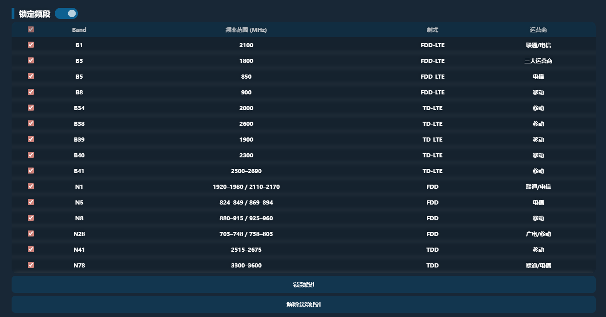

### 7.4 锁定基站

> “锁定基站”用于将设备连接限制在指定基站或指定小区上。  
> 与锁频段相比，锁基站属于更高阶的网络调试能力，适合在熟悉信号参数含义的前提下使用。

锁基站区域包含：

- 已锁基站列表
- 当前基站信息
- 邻区或候选基站列表
- 网络类型选择（4G / 5G）
- PCI 和频率输入项

后台还提供：

- 选择当前基站
- 锁定基站
- 解除锁定基站
- 停止刷新后逐个锁定多个基站

常见用途包括：

- 固定连接到表现更稳定的基站
- 避免设备在多个基站之间来回切换
- 测试某一目标基站的实际表现
- 配合频段与信号参数进行更细致的网络优化

风险提示：

- 选错基站可能导致信号不稳定、无信号或无法入网
- 周围环境变化后，原本合适的基站也可能不再合适
- 不建议在不了解 PCI、频率和当前网络结构的情况下随意锁站

建议操作方式：

- 先观察当前基站及邻区列表
- 先测试当前基站表现，再决定是否锁定
- 操作前可先停止刷新，避免参数实时变化影响选择

如需恢复默认连接状态，可使用“解除锁定基站”功能。

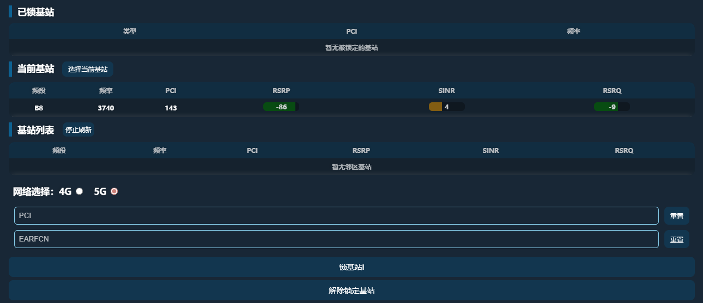

### 7.5 APN 设置

> APN 设置用于配置设备接入运营商数据网络所使用的接入点信息。  
> 在多数情况下，设备会根据 SIM 卡自动匹配 APN；但当设备无法联网、部分卡无法正常注册数据业务，或需要特殊网络配置时，可通过本功能进行调整。

当前后台中的 APN 管理包括：

- 当前 APN 查看
- 自动 APN 模式
- 手动 APN 模式
- 配置文件查看
- 添加 APN
- 修改 APN
- 删除 APN

在手动创建或修改 APN 时，常见字段包括：

- 配置名称
- APN 名称
- 用户名
- 密码
- 鉴权方式
- PDP 类型

使用建议：

- 若设备可正常联网，不建议随意修改 APN
- 若无法联网，可先检查当前 APN 是否匹配当前运营商
- 修改 APN 前，建议先记录原有配置
- 不确定参数时，应优先咨询对应运营商

APN 错误可能导致设备：

- 无法联网
- 无法获取数据业务
- 网络接入异常但信号看似正常

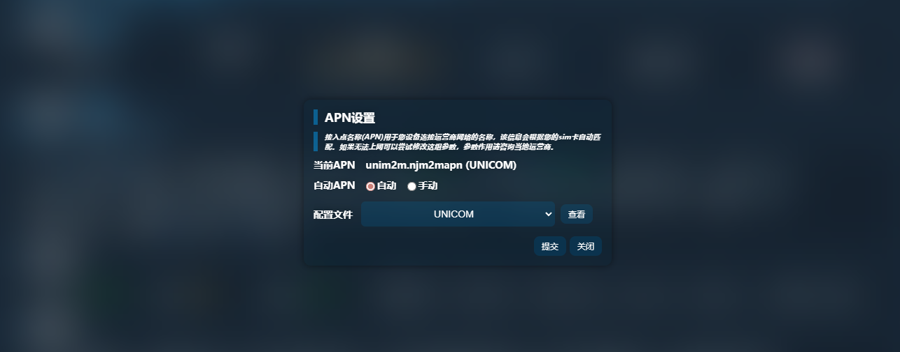


### 7.6 网络漫游

> “网络漫游”用于控制设备在特定网络环境下是否允许使用漫游相关能力。  
> 该功能是否有效，取决于设备、SIM 卡、运营商策略及当前网络环境。

适合使用该功能的场景包括：

- 特殊网络环境测试
- 异地或跨区域使用时的网络接入尝试
- 某些卡在默认状态下无法正常附着网络时的辅助排查

使用建议：

- 若不了解当前卡的漫游策略，不建议长期随意切换
- 开启后若出现异常流量、异常注册或资费问题，应及时恢复并核查运营商规则

### 7.7 内网测速

“内网测速”用于测试设备在当前局域网或后台代理链路下的传输能力，主要用于参考本地链路表现。

内网测速支持：

- 设置测速块大小
- 开始测速
- 停止测速
- 循环测速
- 显示当前速度、平均速度、总耗时和下载总量

适合使用内网测速的场景包括：

- 测试设备局域网访问性能
- 粗略观察后台链路性能变化
- 配合网络模式、锁频锁站、WiFi 设置做前后对比

说明：

- 内网测速结果主要用于参考，不等同于运营商公网实际速度
- 测速时建议避免同时进行大流量任务，以免影响结果判断
- 内网测速并不会消耗运营商流量

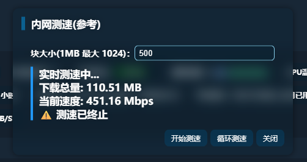

### 7.8 流量测速

> “流量测速”用于测试蜂窝数据连接下的实际下载能力。  
> 与内网测速相比，这一功能更贴近用户真实上网场景，但结果仍受测速地址、线程数、代理方式、运营商和当前信号环境影响。

包括以下内容：

- 测速地址
- 线程数量
- 开始测速
- 循环测速
- 实时结果显示

使用建议：

- 测试前尽量保持设备网络环境稳定
- 测速时不要同时进行大流量下载任务
- 测速结果应结合信号参数、频段、当前基站和网络模式一起判断
- 请使用稍大的文件下载链接(比如某二字、四字游戏的本体下载链接 w (

注意：

- 已明确提示，该测速经过内网代理转发，数据仅供参考
- 由于代理 API 限制，单次下载时间可能存在固定上限
- 若结果偏低，不一定完全代表实际公网能力，也可能受到当前测试服务器或链路限制影响


## 8. 通信与调试功能

### 8.1 短信收发

> “短信收发”用于查看设备短信列表、读取新短信并直接发送短信。  
> 这是 UFI-TOOLS 中常用的通信功能之一，适合验证码接收、设备通知查看和基础短信操作。

短信窗口包含以下核心内容：

- 短信列表
- 收件人输入框
- 短信内容输入框
- 发送按钮

使用方法：

1. 点击“短信收发”按钮。  
2. 在短信列表中查看已有短信。  
3. 如需发送短信，在“收件人”输入手机号。  
4. 在“输入短信内容”中填写内容。  
5. 点击“发送”。  

适用场景：

- 查看验证码短信
- 查看运营商通知短信
- 发送测试短信
- 处理与设备绑定的号码通知

使用建议：

- 发送前确认号码格式正确
- 若短信列表不更新，先检查设备网络状态和短信权限
- 若设备卡不支持短信业务，本功能可能无法正常工作

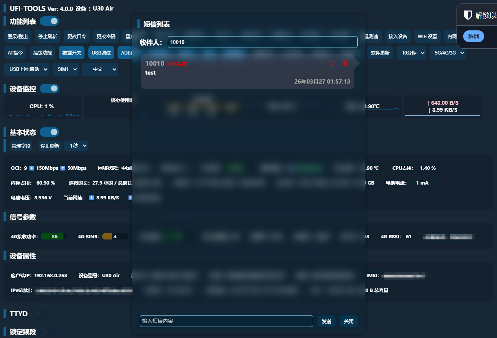

### 8.2 短信转发与设备信息通知

> “短信转发”用于在收到新短信后，将短信内容自动转发到指定目标。  
> 该功能适合远程接收验证码、统一收集通知短信、无人值守设备管理等场景。

“设备信息通知”指在开启“短信转发”后，可以按照电源状态或者配合定时任务，推送设备相关信息。
相关信息包括：

| 分类     | 内容               |
| -------- | ------------------ |
| 流量信息 | 日用流量、月流量   |
| CPU状态  | CPU占用、CPU温度   |
| 系统资源 | 内存使用           |
| 设备信息 | 软件版本、设备型号 |
| 电源信息 | 电池与供电信息     |
| 运行状态 | 开机时长           |

短信转发模块包含以下主要能力：

| 分类     | 内容                         |
| -------- | ---------------------------- |
| 基础控制 | 总开关                       |
| 转发配置 | 转发规则、同时转发设备信息   |
| 通知类型 | 电源状态通知                 |
| 转发方式 | SMTP转发、CURL转发、钉钉转发 |

支持的转发方式如下：

- `SMTP方式`：将短信转发到指定邮箱
- `CURL方式`：通过自定义请求转发到 Telegram、企业微信、PushPlus、Bark 等服务
- `钉钉方式`：通过钉钉机器人 Webhook 转发

短信转发支持的占位符包括：

- `{{sms-body}}`
- `{{sms-time}}`
- `{{sms-from}}`

还可附带转发设备信息，例如：

| 变量                     | 中文说明                     |
| ------------------------ | ---------------------------- |
| `{{daily-flow}}`         | 当日流量（Android统计）      |
| `{{cpu-temp}}`           | CPU温度                      |
| `{{cpu-usage}}`          | CPU占用率                    |
| `{{mem-usage}}`          | 内存使用率                   |
| `{{battery-level}}`      | 电池电量                     |
| `{{battery-current}}`    | 电池电流                     |
| `{{battery-voltage}}`    | 电池电压                     |
| `{{model}}`              | 设备型号                     |
| `{{monthly-flow-count}}` | 本月流量（Android统计）      |
| `{{app-ver}}`            | UFI-TOOLS版本号              |
| `{{monthly-flow-sum}}`   | 本月累计流量（原厂后台统计） |

使用建议：

- 先配置一种转发方式并验证成功，再增加复杂规则
- 用于验证码接收时，建议优先测试消息是否能稳定到达
- 若启用“同时转发设备信息”，消息内容会更丰富，但也更长
- 配置 CURL 时，整条命令必须保持单行输入，不要换行

通过CURL方式转发到企业微信脚本示例：

```shell
curl -X POST "https://qyapi.weixin.qq.com/cgi-bin/webhook/send?key=xxxxxxxx" -H "Content-Type: application/json" -d '{"msgtype": "text", "text": {"content": "【号码】{{sms-from}}\n【短信内容】\n{{sms-body}}\n【时间】{{sms-time}}\n【日用流量】{{daily-flow}}\n【月流量（高级后台）】{{monthly-flow-count}} \n【月流量（官方后台）】{{monthly-flow-sum}}\n【CPU温度】{{cpu-temp}}\n【CPU占用】{{cpu-usage}}\n【内存占用】{{mem-usage}}\n【软件版本】{{app-ver}} \n【型号】U30联通 \n【开机时长】{{boot-time}}"}}'
```

短信转发还可设置转发规则，可以设置号码黑名单与短信关键字黑名单
**号码黑名单：符合号码的短信将不会被转发**
**短信关键字黑名单：包含短信关键字的短信将不会被转发**
填写规则：**每行一个**

风险与注意事项：

- 配置错误会导致短信无法成功转发
- Webhook、Token、邮箱密码等配置应妥善保管
- 若规则过多或内容过长，可能影响消息可读性

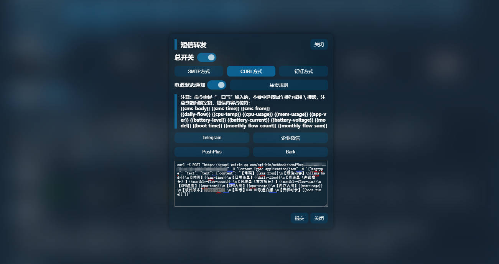

### 8.3 AT 指令

> “AT 指令”用于向设备基带发送 AT 命令。  
> 该功能属于高级调试能力，可用于读取设备信息、查询参数、执行部分网络与基带操作。

AT 指令窗口包含以下部分：

- 自定义 AT 指令输入框
- AT 执行槽位选择
- 快捷指令区
- 执行结果显示区

快捷指令中包含的常见操作有：

- 查询签约速率
- 查询 IMEI
- 强力查串
- 填入改串指令
- 查询基带信息
- 重启基带
- 查询 IMSI
- 高铁模式

使用方式：

1. 打开“AT 指令”窗口。  
2. 选择 AT 执行槽位。  
3. 输入以 `AT+` 开头的命令，或直接点击快捷指令。  
4. 查看执行结果。  

重要说明：

- 自定义 AT 属于高风险操作
- 输入错误命令可能导致网络异常、功能异常或设备状态异常
- 内置卡、物联网卡用户不要随意执行涉及 IMEI 修改的相关操作

文档中必须明确提醒用户：

- 只有在明确理解指令含义时才执行
- 先执行只读查询类命令，再尝试修改类命令
- 任何写入型、改串型、重启型命令都应谨慎使用

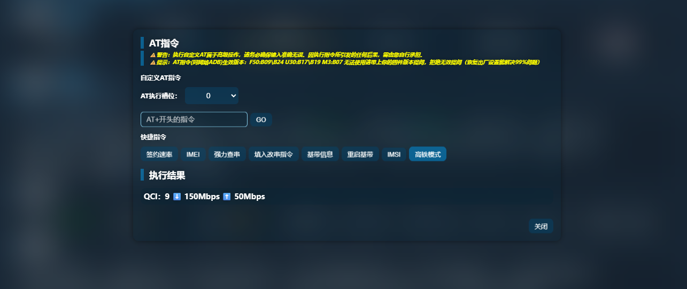

### 8.4 USB 调试

> “USB 调试”用于控制设备调试接口状态，是后续高级维护、安装更新、无线 ADB、自定义调试操作的重要前置条件。

**注* 如果您启用了“高级功能” 则USB调试功能则为可选项，“USB调试功能做到的事情皆可由“高级功能”替代.**

该功能的主要作用包括：

- 为后续调试操作提供基础入口
- 配合软件更新功能工作
- 配合网络 ADB、自定义维护和部分高级功能使用

使用建议：

- 仅在需要调试、维护、安装或更新时启用
- 不使用时可按需关闭，以减少暴露面
- 若某些功能提示依赖调试能力，应先确认此开关状态

安全提醒：

- 启用 USB 调试会增加设备可操作性
- 在公共或不受控环境中，启用调试能力会提高安全风险

### 8.5 网络 ADB 自启

“ADB 自启”用于控制无线 ADB 或网络 ADB 的自动启用状态，打开后会在用户下一次启动设备时自动激活无线ADB调试。  
该功能适合需要远程维护、自动恢复调试能力、配合高级功能或软件更新的场景。

与该功能相关的界面信息包括：

- 网络 ADB 状态
- USB 调试开关状态
- 固件版本
- 启用无线 ADB 端口
- 禁用无线 ADB 端口

作用说明：

- 设备重启后，系统可自动激活网络 ADB
- 便于远程维护设备，无需每次手动重新开启
- 与软件更新、AT 能力、开发者相关功能关联紧密

使用建议：

- 仅在明确需要远程维护时启用
- 启用后应注意所在网络环境是否安全
- 若自动启用失败，应先检查 USB 调试状态、设备网络状态和固件兼容性

### 8.6 TTYD 终端

> TTYD 是 UFI-TOOLS 高级功能 提供的网页终端能力。  
> 用户启用高级功能后，刷新网页，可以通过浏览器访问终端页面，对设备执行命令行级别的维护操作。

TTYD 的作用包括：

- 远程进入设备终端
- 执行脚本、查看状态、进行维护
- 配合高级功能进行系统级操作

重要说明：

- TTYD 与高级功能直接相关
- 启用后会开放终端访问入口
- 默认端口为 `1146`
- 访问TTYD需要提供UFI-TOOLS的设备口令
- 输入口令时不会显示用户输入的口令文本，为静默输入

如果您使用插件隐藏了TTYD，则TTYD不会显示在 UFI-TOOLS 网页中，但通过1146端口仍可访问。
如果你想恢复TTYD在网页中的可见性，可以：
1. 卸载隐藏TTYD功能的插件，然后清空浏览器缓存即可恢复
2. 卸载隐藏TTYD功能的插件，三击网页UFI-TOOLS标题区域，点击“重置TTYD端口” 即可恢复。


使用建议：

- 仅在需要命令行维护时启用
- 修改端口后应同步记录新的访问地址
- 若设备处于远程环境，应先确认访问控制和网络安全策略

安全提醒：

- TTYD 属于高权限入口
- 暴露到不安全网络环境可能带来严重风险


## 9. 系统与设备控制

### 9.1 性能模式

> “性能模式”用于调整设备运行策略，使设备在性能、功耗和发热之间进行取舍。  
> 该功能适合在测速、长时间运行、轻载使用或高负载处理时按需切换。

适合启用性能模式的场景包括：

- 需要更高网络处理能力
- 需要更快响应后台操作
- 进行测速、锁频锁站测试或插件运行测试
- 需要运行透明代理软件，防火墙软件，广告拦截软件，网盘软件等有负载的场景

使用建议：

- 高性能设置会带来更高发热和更高功耗
- 长时间高负载运行时，应配合关注 CPU 温度和供电状态
- 若设备散热条件一般，不要长时间持续高负载运行

### 9.2 指示灯控制

> “指示灯”用于控制设备外部状态灯的显示行为。  
> 该功能适合在夜间使用、固定部署或需要降低可见性的场景中使用。

适合使用指示灯控制的场景包括：

- 夜间环境下减少灯光干扰
- 固定部署设备时降低视觉暴露
- 根据使用习惯决定是否保留状态灯提示

使用建议：

- 关闭指示灯后，设备状态变化不再能通过灯光直接观察
- 需要现场判断联网或充电状态时，建议保留指示灯功能

### 9.3 NFC 控制

> “NFC”用于控制设备 NFC 相关功能。  
> 该功能是否有效，取决于设备硬件是否具备 NFC 能力及当前固件是否支持。

适合使用 NFC 控制的场景包括：

- 需要关闭不必要的近场通信功能
- 出于省电或减少功能暴露的考虑
- 针对具备 NFC 功能的机型进行专项测试

使用建议：

- 若设备没有 NFC 硬件，该项功能可能无实际效果
- 调整后可观察设备行为变化，以确认是否生效

### 9.4 文件共享（SMB）

> “文件共享”用于控制设备文件共享能力。  
> 该功能与设备本地文件访问、局域网共享与高级功能存在关联，关闭该项可能会导致高级功能失效。
> **所以，当用户启用高级功能时，即使用户主动关闭文件共享，UFI-TOOLS也会在下次开机时自动开启该功能。**

文件共享适合以下场景：

- 需要在局域网内访问设备文件
- 需要交换配置文件、脚本或日志
- 需要配合高级功能进行扩展操作

重要说明：

- 部分高级功能依赖文件共享状态
- 已启用高级功能后，不要随意关闭文件共享，否则相关能力可能失效

安全建议：

- 在远程访问场景下，不要将文件共享SMB端口暴露到外网
- 启用后若存在敏感文件，应自行做好访问控制

### 9.5 休眠时间设置

> “休眠时间设置”用于控制设备在空闲状态下进入休眠的时间策略。  
> 该功能仅在配备电池的机型上生效。

可选项包括：

- 不休眠
- 5 分钟
- 10 分钟
- 20 分钟
- 30 分钟
- 1 小时
- 2 小时

该功能用于在省电需求和在线可用性之间做平衡。

使用建议：

- 需要设备长时间保持在线时，选择“不休眠”
- 以续航优先时，可设置较短休眠时间
- 设备承担短信转发、远程访问或自动化任务时，应避免设置过短休眠时间

### 9.6 SIM 卡切换

“SIM 卡切换”用于在多卡设备或特定机型上切换当前使用的卡槽或线路。  
不同机型下显示方式不同，常见选项包括：

- `SIM1`
- `SIM2`

在部分机型中，还会显示：

- `移动`
- `电信`
- `联通`
- `外置`

适合使用 SIM 切换的场景包括：

- 测试不同卡槽或不同运营商线路
- 切换主用与备用卡
- 进行网络兼容性测试

使用建议：

- 切换后应观察网络状态、信号参数和 APN 是否同步变化
- 若切换后无法联网，应检查对应卡槽状态、运营商配置和 APN 设置


### 9.7 USB 上网模式

“USB 上网模式”用于设置设备通过 USB 输出网络连接时所采用的协议方式。  
可选项包括：

- `USB上网:自动`
- `RNDIS`
- `CDC-ECM`

该功能适合以下场景：

- 设备通过 USB 连接电脑、路由器或其他终端时
- 需要测试不同主机系统对 USB 网络协议的兼容性时
- 排查 USB 上网识别异常时

各模式说明：

- `自动`：由设备自动选择合适方式
- `RNDIS`：适合较常见的 USB 网络共享场景
- `CDC-ECM`：适合特定系统或特定设备对该协议的兼容需求

使用建议：

- 不确定时先使用“自动”
- 若主机无法识别 USB 网络，可尝试在 RNDIS 与 CDC-ECM 之间切换
- 切换后建议重新插拔连接或重新识别网络设备


### 9.8 USB 状态查看

“USB 状态”用于查看当前 Type-C 或 USB 相关连接状态。  
这部分功能用于配合 USB 上网模式、外设识别和调试工作。

用户可以通过该窗口查看：

- 当前已连接 USB 设备
- 连接识别状态
- 相关接口信息

适合使用该功能的场景包括：

- 排查 USB 上网无法识别
- 检查外接设备是否被系统识别
- 辅助确认 Type-C 外设连接情况

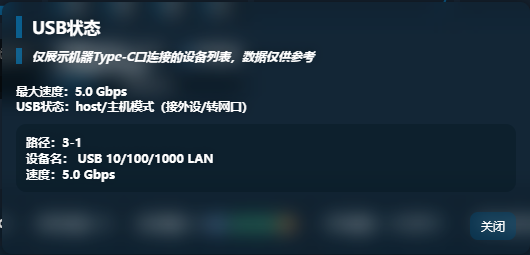

## 10. 本地网络与接入管理

### 10.1 WiFi 设置

> “WiFi 设置”用于管理设备无线热点的核心参数。  
> 该模块覆盖热点开关、频段、名称、安全模式、密码和接入数量控制。

可配置内容包括：

- WiFi 开关状态
- 2.4G / 5G 频段切换
- SSID
- 是否广播 SSID
- 安全模式
- WiFi 密码
- 最大接入数量
- 二维码

安全模式可选项包括：

- `OPEN`
- `WPA2(AES)-PSK`
- `WPA3-PSK`
- `WPA2-PSK/WPA3-PSK`

使用建议：

- 需要兼容更多旧设备时，可选择 WPA2
- 需要更高安全性时，可选择 WPA3 或混合模式
- 不建议长期使用 OPEN 模式
- WiFi 密码应设置为足够复杂的强密码
- 最大接入数量实际上受制于系统限制，最大只支持10台，可以配合magisk模块解除接入数限制

补充说明：

- WiFi 频段切换项属于即时修改项
- 二维码可用于方便终端快速接入当前热点


### 10.2 内网设置

> “内网设置”用于调整设备局域网侧的基础网络参数。  
> 该模块决定后台访问地址、局域网地址规划和本地网络分配策略。

可配置内容包括：

- 网关地址
- 子网掩码
- DHCP 开关

该功能适合以下场景：

- 需要修改设备局域网地址段
- 需要避免与上级网络地址冲突
- 需要重新规划局域网终端分配范围

重要说明：

- 修改网关地址后，后台访问地址会同步变化
- 修改后若浏览器无法继续访问，应使用新的网关地址重新进入后台

例如：

- 修改前访问地址为 `http://192.168.0.1:2333`
- 若网关改为 `192.168.8.1`
- 修改后应使用 `http://192.168.8.1:2333`

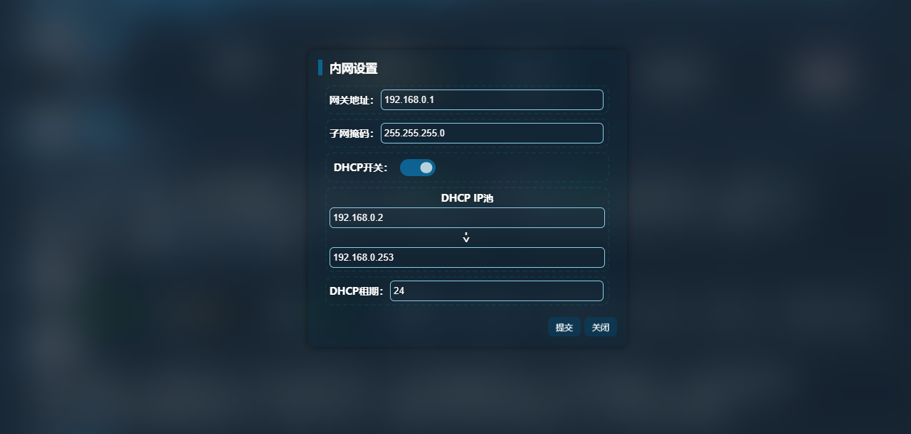

### 10.3 DHCP 设置

> DHCP 设置用于控制设备是否为接入终端自动分配 IP 地址，以及分配范围和租期。

可配置内容包括：

- DHCP 开关
- DHCP IP 池起始地址
- DHCP IP 池结束地址
- DHCP 租期

使用建议：

- 保持 DHCP 开启，可减少普通终端接入时的手动配置工作
- 若有固定地址规划需求，可按需调整 IP 池范围
- 设置 DHCP 地址池时，应避免与网关地址冲突
- 设置地址池时，应避免与已经固定分配的地址冲突

DHCP 适合以下场景：

- 多终端接入热点并自动获取地址
- 统一管理局域网地址范围
- 需要控制接入设备的地址分配区间

若 DHCP 参数设置错误，可能导致接入终端：

- 无法获取 IP 地址
- 能连接热点但无法访问网络
- 与现有地址产生冲突

### 10.4 接入设备管理

> “接入设备管理”用于查看当前连接到设备热点或局域网的终端信息。  
> 该功能适合排查占用网络的终端、识别陌生设备以及管理局域网接入情况。

> “黑名单”用于限制指定终端继续接入当前设备网络。  
> 该功能适合在发现陌生终端、异常终端或不希望继续接入的终端时使用。

接入设备列表中可见信息包括：

- 主机名称
- MAC 地址
- IP 地址
- 接入类型

接入类型包括：

- 无线
- 有线

使用场景包括：

- 查看当前有哪些终端连接到了设备
- 判断是否存在未知设备接入
- 配合流量异常排查终端占用情况
- 核对某一终端是否已成功获取 IP 地址

黑名单支持的操作包括：

- 将接入设备加入黑名单
- 将已加入黑名单的设备解封

适合使用黑名单的场景包括：

- 发现未知设备接入热点
- 某终端长期占用带宽
- 需要临时禁止某终端接入

使用建议：

- 拉黑前先确认目标设备的 MAC 地址和 IP 地址，避免误封
- 若误将常用终端加入黑名单，可在黑名单区域执行解封
- 对关键维护终端操作时要格外谨慎，避免把自己的管理设备拉黑


## 11. 流量与自动化功能

### 11.1 流量管理

> “流量管理”用于按套餐思路管理设备流量使用情况。  
> 该功能可帮助用户记录总额度、当前已用量、清零日期和提醒阈值，并在接近阈值时给出提示。
> 注意：错误设置提醒阈值可能会导致信号指示灯异常闪烁红灯问题

可配置内容包括：

| 分类       | 内容                                       |
| ---------- | ------------------------------------------ |
| 功能开关   | 是否启用流量管理、是否启用流量清零         |
| 套餐设置   | 套餐形式、清零日期、流量套餐总量、容量单位 |
| 使用与提醒 | 已用流量、提醒阈值                         |

支持的容量单位包括：

- MB
- GB
- TB
- PB

使用建议：

- 将“流量套餐”填写为运营商套餐总额度
- 将“已用流量”与当前实际使用情况保持一致
- 将“清零日期”设置为运营商套餐结算日
- 将“提醒阈值”设置为适合自己的预警比例，例如 `80%`

重要说明：

- 当流量达到设定阈值时，设备会进行提醒
- 若启用“流量清零”，系统会按设定周期重置统计

适合使用流量管理的场景包括：

- 套餐有明确月流量上限
- 需要避免跑超流量
- 需要对长期部署设备做流量控制


### 11.2 定时任务

> “定时任务”用于让设备在指定时间自动执行预设动作。  
> 该功能可将重复性操作自动化，适合长期运行设备和无人值守场景。

定时任务模块包含以下主要部分：

- 任务列表
- 添加任务
- 刷新任务
- 删除或修改已有任务

任务项包含的关键内容包括：

- 任务名称
- 触发时间
- 是否重复执行
- 动作参数

使用建议：

- 任务名称应清晰，便于区分用途
- 定时任务较多时，应定期整理，避免重复或冲突
- 涉及网络切换、重启、关机等动作时，应避开高峰使用时段

适合使用定时任务的场景包括：

- 定时重启设备
- 定时切换网络模式
- 定时开关 WiFi
- 定时开启或关闭数据连接
- 定时执行维护动作

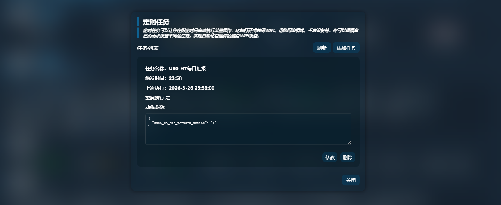

### 11.3 自动执行动作说明

> 在添加或编辑定时任务时，后台提供一组可直接填入的动作模板。  
> 这些动作可用于快速生成任务参数，减少手动输入错误。

当前可用动作包括：

| 分类       | 内容                                                        |
| ---------- | ----------------------------------------------------------- |
| 通信与通知 | 转发设备信息、发送短信                                      |
| 系统与设备 | 指示灯、NFC、文件共享、性能模式                             |
| 网络控制   | 打开数据、关闭数据、关闭WiFi、开启WiFi（5G/2.4G）、网络漫游 |
| 网络模式   | 切换到5G/4G/3G、5G NSA、5G SA、仅4G                         |
| 系统操作   | 关机、重启                                                  |
| 基站控制   | 解锁基站、锁基站                                            |
| SIM管理    | 切换SIM卡1、切换SIM卡2、切换运营商（移动/联通/电信/外置）   |
| 调试功能   | USB调试                                                     |

使用建议：

- 先测试单个动作，再投入长期自动执行
- 涉及关机、重启、锁站、切卡的任务应单独验证效果
- “转发设备信息”依赖短信转发功能，使用前应先完成短信转发配置

注意事项：

- 多个定时任务若设置在相近时间，可能相互影响
- 高风险动作不建议高频触发
- 涉及网络类动作的任务执行后，应观察设备是否恢复正常联网

注意，部分任务参数需要自己按照自己的实际情况修改，填写无效的任务会无法执行
请在使用定时任务功能前先简要了解一下JSON格式

比如锁基站的动作参数是：
```json
{
  "goformId": "CELL_LOCK",
  "pci": "912",
  "earfcn": "504990",
  "rat": "此处 锁5G填:16 锁4G填:12"
}
```

pci earfcn rat 三个参数是由用户自定义的，需要用户根据实际情况填写
示例：

```json
{
  "goformId": "CELL_LOCK",
  "pci": "113",
  "earfcn": "504990",
  "rat": "16"
}
```


### 11.4 开机自启与脚本与定时脚本能力

> UFI-TOOLS 支持与开机后的自动执行能力配合使用。  
> 这部分能力用于让设备在启动后自动恢复某些配置、端口、服务或用户自定义逻辑。
> 定时脚本可以以25-30s每次的速度执行

**开机自启与脚本与定时脚本仅在高级功能启用时生效。**

自启脚本路径位置：`/sdcard/ufi_tools_boot.sh`
定时脚本路径位置：`/sdcard/ufi_tools_schedule.sh`

相关能力包括：

- 后台服务开机自启
- 启动后自动恢复部分功能状态
- 启动脚本编辑
- 与高级功能配合执行开机脚本

适合使用该能力的场景包括：

- 设备断电重启后自动恢复服务
- 自动恢复远程维护入口
- 自动恢复某些固定配置
- 自动执行用户维护脚本

使用建议：

- 启动脚本内容应简洁明确，避免加入过多高风险命令
- 内容脚本应该从外部引入，而不是将内容填写在启动脚本里面
- 脚本应保持一行一个，且使用 `nohup &` 后台运行，防止脚本阻塞
- 每次修改启动脚本后，都应重启设备验证执行结果
- 若脚本会影响联网、共享、调试或系统控制，应先保留恢复手段

风险提示：

- 启动脚本错误可能导致功能异常或启动后状态异常
- 自动恢复类逻辑若配置不当，可能在每次开机后重复产生问题

## 12. 高级功能

### 12.1 高级功能简介

> “高级功能”是 UFI-TOOLS 面向进阶用户提供的系统级扩展能力。  
> 该功能会为设备增加更深层的控制入口和更强的维护能力。
> 该功能为 UFI-TOOLS 的特色功能

高级功能适合以下用户：

- 需要远程维护设备的用户
- 需要执行系统级调试的用户
- 需要使用 TTYD、开机脚本或 RootShell 能力的用户
- 需要对设备做进一步扩展和深度定制的用户
- 需要安装使用各种功能性插件的用户

不适合以下用户：

- 只需要基础联网和基础管理功能的用户
- 不清楚相关功能含义和风险的用户
- 不具备恢复和排障能力的用户


### 12.2 开启条件

启用高级功能前，应确认以下条件已经满足：

- 设备已完成设备端安装
- 后台服务运行正常
- 设备网络状态正常
- 当前设备与当前固件版本支持该能力

高级功能界面会显示以下状态信息：

- 高级功能当前状态
- 网络 ADB 状态
- USB 调试开关状态
- 固件版本

若开启失败，优先检查以下问题：

- 当前固件环境不兼容
- 系统配置未按预期写入
- 尝试将设备恢复出厂设置后，重新部署UFI-TOOLS再试

### 12.3 功能内容

当前高级功能包含以下能力：

| 分类        | 内容                                                         |
| ----------- | ------------------------------------------------------------ |
| 文件与共享  | 优化Samba目录，支持外部存储访问                              |
| 终端与Shell | 提供TTYD终端（默认端口 `1146`）、内置RootShell、支持执行 `one_click_shell.sh` |
| 网络与安全  | 屏蔽敏感端口的IPv6访问、支持禁用官方固件更新                 |
| 自动化能力  | 支持定时脚本、开机脚本                                       |
| CPU控制     | 支持关闭小核、开启小核                                       |
| 系统维护    | 支持提取Boot                                                 |

高级功能界面中对应的操作项包括：

| 分类       | 内容                                    |
| ---------- | --------------------------------------- |
| 功能管理   | 添加高级功能、移除高级功能（重启生效）  |
| 系统控制   | 禁用固件更新、提取Boot                  |
| 脚本与执行 | 编辑启动脚本、执行 `one_click_shell.sh` |
| CPU控制    | 关闭小核、开启小核                      |

这些能力的用途如下：

| 功能         | 说明                           |
| ------------ | ------------------------------ |
| `TTYD`       | 提供网页终端访问入口           |
| `RootShell`  | 提供js接口，赋予JS命令执行能力 |
| 启动脚本     | 开机后自动执行用户维护逻辑     |
| 禁用固件更新 | 阻止原厂更新机制干预当前环境   |
| 小核控制     | 用于性能测试或特殊调优         |
| 提取Boot     | 用于进阶备份和分析             |

### 12.4 使用注意事项

使用高级功能时，必须明确以下事项：

- 启用高级功能后，不要关闭文件共享
- 若关闭文件共享，高级功能可能失效
- 移除高级功能后，部分效果需要重启后才会生效
- 涉及脚本、RootShell、TTYD、Boot 提取的操作都属于高风险操作

风险提示：

- 操作不当可能导致设备异常
- 配置错误可能导致后台能力失效
- 脚本错误可能导致设备开机后持续异常
- 不当开放终端入口可能带来安全风险

恢复提示：

- 若高级功能相关配置异常，可按界面提示执行：

`sh /sdcard/unlock_samba.sh`

然后重启设备。

使用建议：

- 启用前先备份重要配置
- 每次只调整一个高风险项目
- 每执行一次系统级操作后，都应验证联网、后台访问和主要功能是否正常
- 远程环境下不要一次性启用多个高风险选项

## 13. 插件与界面个性化

### 13.1 插件功能总览

> UFI-TOOLS 提供独立的插件功能，用于扩展后台页面的显示效果、交互能力和附加逻辑。插件系统可用于补充前端功能、增加快捷操作、调整页面行为，或为特定使用场景提供定制能力。

插件页面会显示插件相关提示信息，并对插件内容、总大小和启用状态进行统一管理。插件功能属于扩展能力，不属于基础联网所必需的功能。

部分插件依赖高级功能。未启用高级功能时，这类插件无法正常工作。

插件加载后会直接影响后台页面行为。启用来源不明或内容不明的插件，可能导致页面异常、功能冲突、性能下降或安全风险。

### 13.2 插件添加、编辑与启停

> 插件管理页面支持添加、编辑、启用、停用、排序和删除插件。

可通过“添加插件”导入插件文本文件。界面支持的插件文件格式通常为 `.txt`，但实际上支持所有文本文件，例如 `.js`, `.html`。导入后，插件会进入列表，等待启用或进一步编辑。

**可通过点击插件名称来直接编辑插件内容。**

插件编辑窗口支持直接修改插件内容。插件内容可包含脚本、样式和元数据。修改完成后，应保存并重新检查插件是否按预期生效。

插件列表支持启用和停用单个插件。启用后，插件会参与后台页面加载；停用后，插件不会再注入当前页面逻辑。

插件列表支持拖动排序。多个插件同时启用时，排序会影响加载顺序。存在依赖关系或样式覆盖关系的插件，应按设计要求调整顺序。

删除插件前，应确认该插件没有被当前页面、自动化流程或背景资源引用。


### 13.3 插件商店

> 插件商店用于浏览和安装可用插件。页面支持搜索、分页浏览和插件详情查看。
> 通过搜索框可按插件名称或关键词筛选结果。分页按钮用于切换不同插件页。
> 安装前，应先查看插件说明、适用条件和依赖要求。

插件商店会提示两类重要信息：

- 部分插件依赖高级功能
- 插件可能影响设备性能、页面稳定性或功能兼容性

安装前应确认当前设备环境满足要求。安装后应立即检查页面是否可正常打开、主要功能是否能正常使用。


### 13.4 插件导入与导出

> 插件管理支持插件导入与导出，便于备份、迁移和共享。
> 导出功能可将当前插件内容导出为文件，用于备份现有配置或迁移到其他设备。进行批量调整前，建议先执行导出备份。
> 导入功能可将外部插件文件加入当前插件列表。导入完成后，应检查插件名称、内容和启用状态，避免重复导入同一插件。
> 页面还提供“清空全部”操作。执行后，当前插件列表会被整体清除。该操作会直接移除所有已添加插件，执行前必须先确认已完成备份,点击提交后才会正式清空。

### 13.5 主题背景设置

> UFI-TOOLS 提供主题背景设置功能，用于调整后台页面的视觉样式。

主题背景设置页面包含以下主要项目：

| 分类     | 内容                                                         |
| -------- | ------------------------------------------------------------ |
| 同步功能 | 多设备同步开关、手动同步按钮                                 |
| 背景设置 | 背景图启用开关、背景图链接输入、本地图片上传、背景模糊开关、覆盖色开关 |
| 主题调节 | 文字颜色、主题色、饱和度、亮度、透明度调节                   |
| 操作控制 | 重置主题按钮                                                 |

使用背景图链接时，应确认图片地址可长期访问。使用本地上传图片时，应控制文件大小并确认图片资源已成功保存。

启用背景模糊和覆盖色后，可提升文字可读性。文字颜色、主题色、饱和度、亮度和透明度应配合调整，避免界面对比度过低或信息难以辨认。

“重置主题”可将当前主题参数恢复到初始状态。主题效果异常、参数过度叠加或页面观感混乱时，可直接使用该功能恢复。
"重置主题"需要开启多设备同步功能。

### 13.6 上传文件管理

> 主题背景和部分插件能力会使用上传文件管理功能保存资源文件。该区域用于统一查看和清理已上传内容。
> 上传文件管理可用于确认资源是否已成功写入，也可用于删除不再需要的上传文件。删除上传文件后，引用这些文件的背景图、插件内容或页面资源会立即失效。

执行“清空上传文件”前，应先确认：

- 当前主题背景未引用这些文件
- 当前插件未引用这些文件
- 已完成需要保留资源的本地备份

资源管理混乱、重复上传较多或旧文件已无用途时，可在确认依赖关系后进行清理。

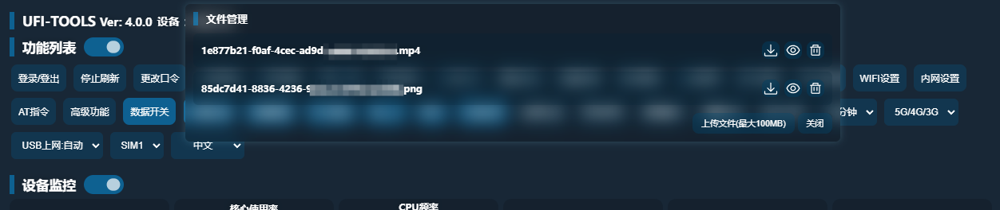

## 14. 软件更新与远程访问

### 14.1 软件更新
> UFI-TOOLS 的软件更新用于获取新版本功能、问题修复和兼容性改进。执行更新前，应先确认当前设备运行稳定，并备份重要配置。

每次进入网页时，都会进行检查更新操作，如果检测到新版本，则会弹窗提示用户有新版本可用。
更新提示分为两种类型：
1. 普通提示：正常提示用户有新版本可用，用户更新后提示消失。
2. 常驻更新提示：即使用户更新后，更新提示依旧存在，设计之初是为了在不变更版本号的情况下强制提示用户更新软件、提高更新率。
常驻更新提示在一段时间后服务器会由维护者手动取消。

更新前应完成以下检查：

- 当前后台可以正常访问
- 设备联网正常
- 当前配置项已记录或已备份
- 已确认目标版本适用于当前设备和固件环境

执行更新后，应立即检查以下内容：

- 后台首页是否可以正常打开
- 登录功能是否正常
- 网络连接是否正常
- 已启用的关键功能是否仍可使用
- 插件和主题是否仍保持兼容

**注意，更新过程中请保持设备正常通电，请不要在更新过程中断开设备电源**
**如果您手动断开了电源后，重启发现UFI-TOOLS网页无法打开，请重新跑一遍UFI-TOOLS安装与部署流程即可正常使用，后台数据大多数情况下不会丢失。**

涉及高级功能、插件、脚本或定制配置的设备，在更新后必须逐项验证。发现异常时，应先停止继续调整，并回退到可用配置或重新部署已确认可用的版本。


### 14.2 远程访问UFI-TOOLS
> 远程访问用于在非同一局域网环境下访问 UFI-TOOLS 后台。该功能适合远程维护、异地查看设备状态和执行有限控制。

远程访问建立前，应先确认以下事项：

- 设备具备可用的外网连接能力
- 访问链路已经正确配置
- 登录口令和后台密码已修改为安全值
- 已明确暴露端口、访问入口和授权范围

远程访问可以通过端口映射、反向代理、VPN 或其他受控链路实现。无论采用哪种方式，都必须限制访问来源，并避免将后台直接暴露给不受控公网环境。

启用远程访问后，应重点控制以下风险：

- 未授权访问
- 弱口令被猜解
- 调试能力被远程滥用
- 高风险功能被误操作

涉及 `TTYD`、网络 ADB、高级功能、插件管理和系统控制的设备，不应直接开放给不可信访问源。远程维护完成后，应及时关闭不再需要的远程入口。

建议使用远程组网插件 `EasyTier` 与 `Tailscale` 插件进行远程管理 (插件商店内可以下载到)

## 15. 常见问题与故障排查

### 15.1 无法访问后台
> 无法访问后台时，先确认访问地址是否正确。UFI-TOOLS 的默认访问地址为：
> `http://设备网关IP:2333`

排查顺序如下：

1. 确认设备已经开机并处于正常运行状态。
2. 确认后台服务已经启动（可以使用scrcpy投屏软件投屏查看服务启动状态）。
3. 确认访问终端与设备网络可达。
5. 确认访问端口仍为 `2333`。
6. 确认浏览器未缓存错误页面或被代理工具干扰。

若曾修改内网设置、DHCP 配置或网关地址，应重新确认设备当前 IP。若页面长时间无法打开，可先重启后台服务，再重新尝试访问。

若远程访问失败，应先在设备本地网络环境中验证后台是否可以正常打开，再检查端口映射、反向代理、VPN 或其他远程链路配置。

### 15.2 无法登录或鉴权失败
登录失败时，应先区分是口令错误、密码错误，还是访问模式与输入凭据不匹配。

排查要点如下：

- 确认输入的登录信息对应当前登录方式
- 确认没有混用“登录口令”和“后台密码”
- 确认输入内容未包含多余空格
- 确认浏览器自动填充没有写入旧密码
- 确认当前后台页面不是旧缓存页面

若多人共用设备，应先确认最近是否有人修改过登录信息。登录恢复前，不应继续执行高风险操作或远程控制操作。

**若口令已修改但始终无法通过鉴权，可以使用scrcpy或者其他投屏软件投屏进入UFI-TOOLS软件内，点击“停止服务”后可以修改登录口令**
**若是原厂后台的登录密码错误，可以使用scrcpy或者其他投屏软件投屏进入应用管理，找到中兴智能WEB或者ZteWebServer，清除该软件的数据即可重置密码**

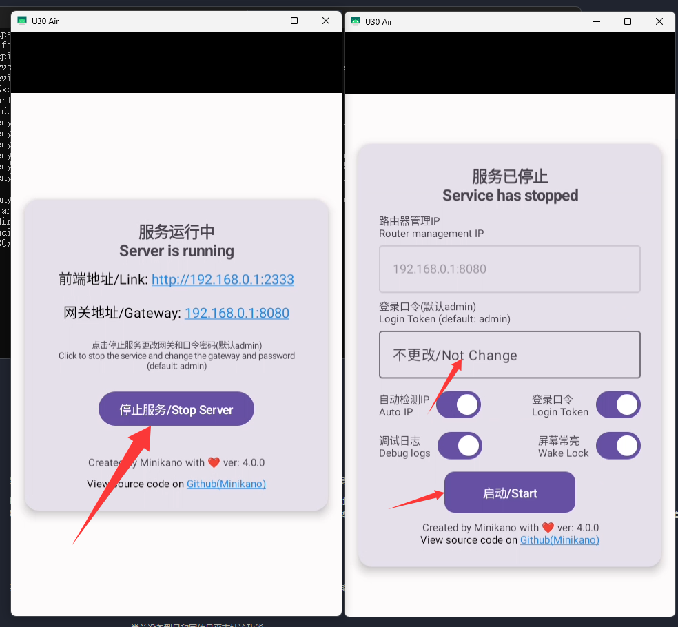

### 15.3 部分功能不可用
> 部分功能不可用时，应先确认该功能是否依赖特定设备状态、系统权限或高级功能支持。

重点检查以下内容：

- 当前设备型号和固件是否支持该功能
- 相关权限是否已经授予
- 后台服务是否完整运行
- 网络状态是否满足该功能执行条件
- 高级功能是否已经启用
- 插件是否改变了页面逻辑或按钮行为
- 设备是否禁用了SELinux，如果未禁用，后台会提示“设备固件不支持”

例如：

- `短信转发` 依赖短信能力和转发配置
- `TTYD`、脚本、自定义扩展能力依赖高级功能
- `网络 ADB`、`USB 调试` 依赖调试能力已开启
- `锁频段`、`锁基站`、`APN` 等能力依赖设备侧接口可用

若问题出现在启用插件、修改主题、调整高级功能或变更脚本之后，应先停用新增内容，再重新验证原始功能是否恢复。

### 15.4 高级功能异常
高级功能异常时，应优先判断是启用失败、执行失败，还是启用后引发系统行为异常。

排查顺序如下：

1. 确认当前设备和固件支持高级功能。
2. 确认后台状态页中的相关状态项是否正常。
3. 确认文件共享未被关闭。
4. 确认近期没有误删脚本、上传文件或相关资源。
5. 确认近期没有执行冲突插件或高风险配置变更。

若高级功能启用后出现异常，应先停止继续叠加修改。涉及 `RootShell`、启动脚本、小核控制、Boot 提取等能力时，应逐项回退最近变更，缩小问题范围。

若因文件共享相关配置导致高级功能异常，可按界面提示执行恢复命令：
`sh /sdcard/unlock_samba.sh`

执行后重启设备，再重新检查高级功能状态。

若设备已出现持续异常、后台无法正常使用或关键功能全部失效，应以恢复可用状态为优先目标，停止继续测试高风险能力。
若始终无法恢复，可以在社区寻求帮助，或直接恢复设备出厂设置，重新部署后台。

## 16. 附录

### 16.1 常见术语说明
为便于阅读本说明书，现对文中涉及的常见术语作统一说明：

- `UFI / MiFi`：指中兴 T760 系列及相关形态的随身 WiFi 设备。
- `Web 后台`：指通过浏览器访问的设备管理页面。
- `设备 IP`：指当前设备在本地网络中的地址
- `网关 IP`：指设备内网网关地址。多数访问场景下，后台访问地址使用该地址。
- `APN`：运营商接入点名称，用于定义移动数据网络接入参数。
- `ADB`：Android Debug Bridge，用于设备调试、命令执行和应用管理。
- `USB 调试`：Android 调试能力入口，用于通过 USB 建立 ADB 连接。
- `网络 ADB`：通过网络而非 USB 建立的 ADB 调试连接方式。
- `AT 指令`：设备调制解调器指令接口，用于查询或控制网络和通信状态。
- `TTYD`：网页终端服务，可在浏览器中访问设备命令行。
- `RootShell`：具备更高系统权限的命令执行环境。
- `插件`：用于扩展 UFI-TOOLS 页面能力、界面效果或交互逻辑的附加内容。
- `高级功能`：UFI-TOOLS 提供的系统级扩展能力。
- `DHCP`：局域网自动分配 IP 地址的服务。
- `SIM 卡切换`：在设备支持的前提下切换当前使用的 SIM 卡。
- `锁频段`：限制设备仅在指定频段上工作。
- `锁基站`：限制设备优先连接指定基站或小区。

### 16.2 默认地址与端口
UFI-TOOLS 在使用过程中涉及以下常见访问地址和端口：

- Web 后台默认访问地址：`http://设备IP:2333`
- Web 后台默认端口：`2333`
- TTYD 默认端口：`1146`

使用这些地址和端口时，应注意以下事项：

- 修改内网设置、网关或 DHCP 配置后，应重新确认后台地址。
- 启用远程访问、反向代理或 VPN 后，外部访问入口可能不再直接使用默认地址。
- 开放 `2333`、`1146` 或调试相关端口前，必须先完成密码加固和访问控制。

若你在部署过程中自行修改了端口或访问路径，应以当前设备实际配置为准，并同步更新维护记录。

### 16.3 参考链接

仓库地址：https://github.com/kanoqwq/UFI-TOOLS

以下资料可作为 UFI-TOOLS 使用、部署和排障时的参考：

- 项目仓库中的 `README.md`
- UFI-TOOLS 一键安装器相关发布说明或演示资料
- 插件商店中的插件说明页面
- B站视频以及酷安对应板块帖子

阅读参考资料时，应优先以当前仓库、当前版本和当前设备环境为准。历史截图、旧版说明或第三方转载内容若与当前版本不一致，应以当前实际界面和当前项目文档为准。

若本说明书与当前软件版本存在差异，应先记录差异项，再根据当前版本补充修订说明。
